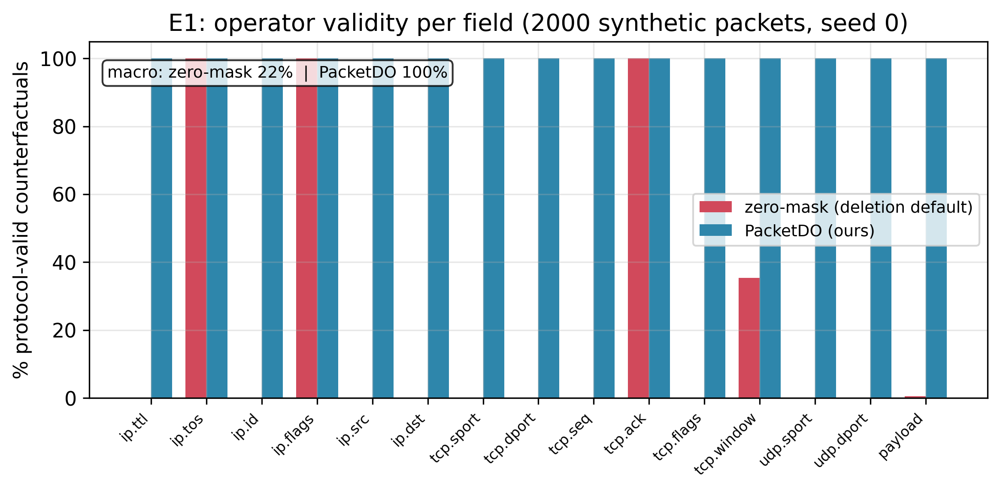
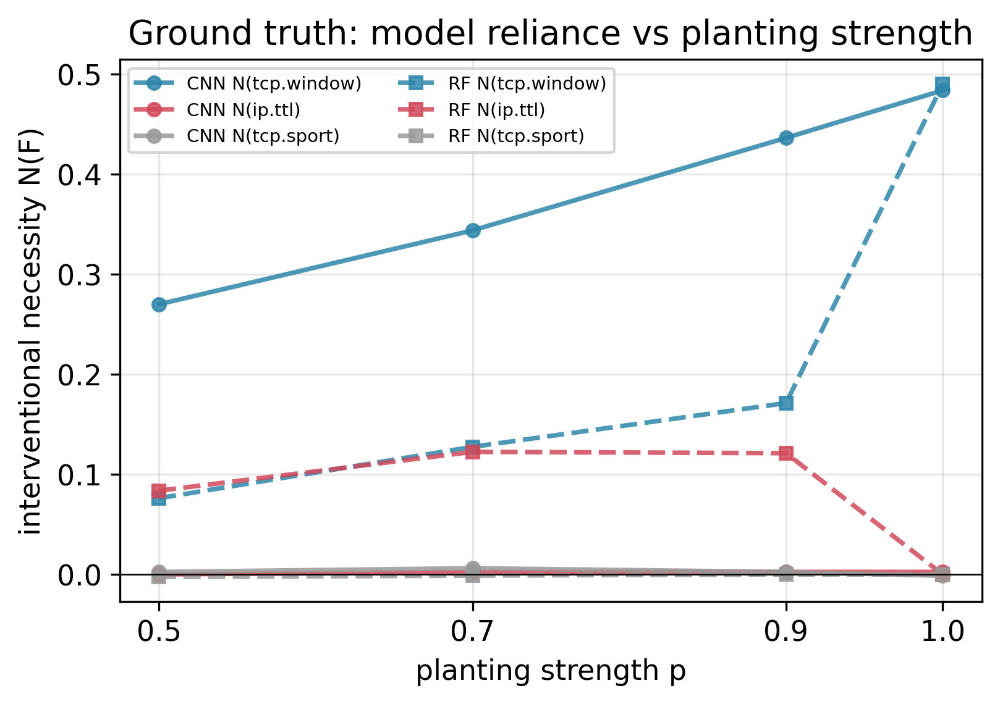
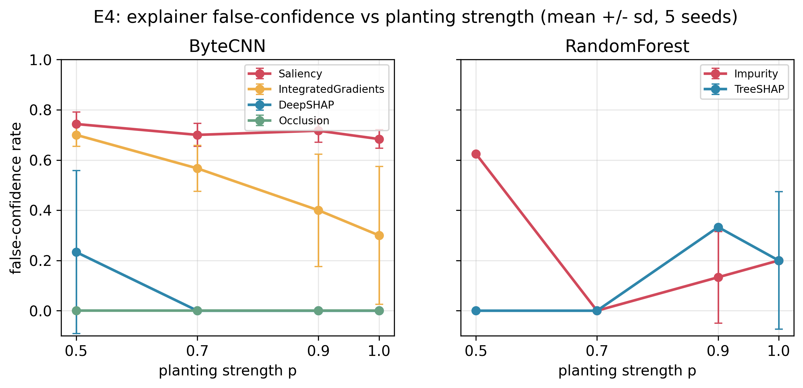
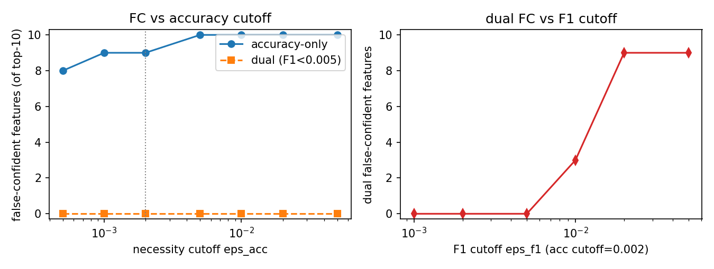

# Protocol-Valid Faithfulness Evaluation for ML-Based Network Traffic Classifiers

**Nakul Sinha**

*Manuscript prepared for IEEE Transactions on Network and Service Management (TNSM).
Citations use keys resolving against `references.bib`; figures are in `figures/`.*

---

## Abstract

Deep learning has become the default tool for network traffic classification and intrusion
detection, and with it a large literature that attaches post-hoc explanation methods (SHAP, LIME,
saliency) to these models to make them trustworthy. That literature almost never checks whether the
explanations are *correct*: in a survey of 107 works, only five define any explanation-quality
metric, and none has a dataset with ground-truth feature importance. We show that the standard way
faithfulness *is* measured elsewhere, deletion/occlusion of "important" features, is not merely
unvalidated for network traffic but protocol-invalid: setting a feature to zero produces a packet
that violates protocol grammar (a broken checksum, an impossible length) and does not arise from a
conforming sender, so the model is queried off-manifold. We introduce **PacketDO**, a protocol-valid
intervention operator that resamples a protocol field from its pooled empirical marginal and
recomputes every dependent field, yielding a counterfactual that is a well-formed packet by
construction. Using PacketDO we build, to our knowledge, the first protocol-valid interventional
ground truth for traffic classifiers (necessity,
sufficiency, and a redundancy degree R(M) measured by intervention, not assumed) and audit eight
widely used attribution methods (integrated gradients, gradient saliency, DeepSHAP, occlusion,
KernelSHAP, LIME, TreeSHAP, and impurity) against it, on models with planted shortcuts of graded
strength, on flow-level real data with documented artifacts, and on two real packet-capture corpora
at the byte level. We find that explainers reliably rank a model's
true shortcut at the top yet simultaneously attribute high importance to redundant features the
model provably does not use; that even exact Shapley values (TreeSHAP) exhibit this false confidence
when a model commits to one of several equivalent shortcuts; and that an explainer's faithfulness
ranking can flip depending on whether features are removed by zero-masking or by PacketDO. On real
captured packets the operator gap is larger than on synthetic traffic (zero-masking valid for 6% of
field interventions versus 100% for PacketDO) and the false confidence reproduces; on an
attention-based Transformer, attention weights are the least faithful explanation of those we audit;
the false confidence persists on the pretrained ET-BERT, which we find holds three substitutable
shortcuts (R(M)=3). We release the operator, the benchmark, and the ground-truth tables.

---

## 1. Introduction

Machine learning now underpins a large fraction of deployed network traffic analysis: encrypted
traffic classification, application identification, and network intrusion detection are all dominated
by deep models that operate on raw packet bytes or on flow-level feature vectors
[@wang2017endtoend; @lotfollahi2020deeppacket; @lin2022etbert]. Because these
models are opaque and because operators are reluctant to act on decisions they cannot interrogate, a
second, rapidly growing literature attaches post-hoc explanation methods (SHAP, LIME, gradient
saliency, attention maps) to traffic classifiers, and presents the resulting feature-importance
scores as evidence that the model is trustworthy. This explainability literature is now large enough
to have its own surveys [@nascita2025survey].

What almost none of it does is check whether the explanations are *correct*. In a recent systematic
survey of 107 works on explainable AI for network traffic analysis [@nascita2025survey], only five
define any explanation-quality metric at all, and the survey reports that no public traffic dataset
carries ground-truth feature importance against which an explanation could be scored. In practice,
explanations are displayed as plots and declared meaningful. The few papers that do attempt a
quantitative check substitute a proxy: either agreement with what a human analyst expects (which
measures plausibility, not faithfulness [@jacovi2020towards]), or a deletion test that removes the
features an explainer called important and measures how much the prediction changes.

This deletion test is the standard notion of faithfulness imported from computer vision and NLP
[@samek2017evaluating; @deyoung2020eraser], and
it is the quiet foundation under most quantitative claims in the field. Our starting observation is
that it is not merely unvalidated for network traffic: it is protocol-invalid. Removing a feature by setting
it to zero, the default in every deletion, occlusion, and AOPC-style metric, produces a byte string
that is no longer a well-formed packet: its header checksum no longer matches its contents, or its
length field disagrees with its actual length. Such a packet is not produced by any conforming sender, so the
model is being queried outside the distribution it was trained on, and the resulting "importance"
is partly an artifact of that extrapolation. (Malformed packets do occur in practice, from NIC
checksum offload or as adversarial inputs; our claim is distributional, that zero-masked packets are
absent from the conforming traffic these classifiers are trained on, not that they can never be
observed. We return to this in Section 8.) The problem is strictly worse than the analogous
critique in vision [@hooker2019benchmark; @rong2022consistent], because a packet's fields are bound
to one another by protocol grammar: you
cannot change one field and leave the rest untouched and still have a legal packet.

There is a second, deeper problem that the traffic-classification setting makes unusually visible.
Traffic datasets are riddled with *shortcuts* [@geirhos2020shortcut], features that predict the
label in the dataset
without reflecting any real property of the traffic, such as the fixed time-to-live of the machine
that generated a class of attacks, or an artifact of the flow-metering tool
[@engelen2021troubleshooting]. A model that learns a
shortcut can be perfectly accurate on held-out data and still be wrong about the world. The most
striking published demonstration of the danger for explanations comes from TRUSTEE
[@jacobs2022trustee]: a decision-tree
surrogate that reproduced a traffic classifier's decisions with perfect fidelity (an F1 of 1.00)
identified three specific header bytes as the basis of its decisions; yet when the authors tampered
with exactly those three bytes, the model's accuracy did not move, because it had learned several
mutually substitutable shortcuts and simply fell back on another. A perfect-fidelity explanation was
causally wrong. This failure mode, redundant shortcuts that make the target of an explanation
non-unique, has never been systematically measured, in traffic classification or anywhere else.

The two literatures that would need to meet in order to address this do not. On one side, the
explainability-for-security literature produces attributions and never intervenes on the model to
check them. On the other, a rigour-focused strand of networking research (TRUSTEE
[@jacobs2022trustee], the 2025 IEEE
S&P systematization of encrypted-traffic classifiers [@wickramasinghe2025sok], and recent
shortcut-detection frameworks [@wang2026biasseeker; @zhao2026shortcutcatcher])
routinely intervenes on traffic (occluding fields, tampering bytes, ablating features) to expose
what models really use, but never calls these interventions explanations and never evaluates an
explainer with them. As a concrete measure of the gap: the S&P 2025 systematization runs 348 feature
occlusion experiments and contains not a single occurrence of the words explainable, interpretable,
SHAP, attribution, or saliency.

We argue that networking is, in fact, the ideal setting in which to close this gap, for a reason that
does not hold in vision or NLP: interventional ground truth for explanations can be constructed
exactly and on-manifold. Protocol field semantics are known, so an attribution has a defined
referent; and packets are rewritable, so a field can be set to a chosen value and the packet
regenerated as a legal packet. Ground-truth evaluation of feature attribution has been established in
vision (by pasting known objects into images [@yang2019bam]) and in NLP (by injecting known lexical
shortcuts into text [@bastings2022shortcuts]), and in both cases it revealed that popular attribution
methods produce false-positive explanations. Neither has ever been done for network traffic, the one
modality where the intervention that defines the ground truth is exact, protocol-structured, and
produces inputs the model could actually receive.

This paper builds that missing instrument and uses it. Our contributions are:

- **(C1) PacketDO (Section 3):** a protocol-valid intervention operator. It sets a chosen protocol field
  to a value resampled from the field's pooled empirical distribution and recomputes every field that
  structurally depends on it (checksums, lengths, offsets) so the counterfactual is a well-formed
  packet by construction. We show experimentally (E1, Section 5.1) that on synthetic packets the deletion
  default produces a protocol-valid counterfactual in only 22.4% of field interventions (macro
  averaged over 15 fields; 10 of 15 fields are at exactly 0% validity and an 11th, the payload, at
  0.6%), versus 100% for PacketDO, because zeroing a
  field breaks its checksum.

- **(C2) An interventional ground-truth benchmark (Sections 3–4):** using PacketDO we define and measure,
  for a trained model, the necessity and sufficiency of each protocol field and a redundancy degree
  R(M), the number of disjoint, individually-sufficient shortcut sets the model holds. These are
  measured by intervention, not assumed. The benchmark combines synthetic traffic with shortcuts
  planted at graded strength (extending the binary shortcut-injection protocol from NLP
  [@bastings2022shortcuts] to a graded, packet-level one) with real data carrying documented
  artifacts.

- **(C3) An audit of eight widely used explainers against that ground truth (Section 5),** reporting for
  each how well its attribution ranking matches interventional necessity, how often it confidently
  attributes importance to a field the model provably does not use (false-confidence rate), and how
  often it misses a field the model does use (blind-spot rate). The eight are integrated gradients,
  gradient saliency, DeepSHAP, occlusion, KernelSHAP, LIME, TreeSHAP, and random-forest impurity.
  (Our original plan listed six methods including DeepLIFT; DeepLIFT was replaced by the two
  perturbation-based methods KernelSHAP and LIME, which probe the off-manifold question more
  directly.)

- **(C4) The operator-sensitivity result (Section 6):** we show that an explainer's measured faithfulness
  can depend on whether features are removed by zero-masking or by PacketDO, so that faithfulness
  comparisons in the literature that used the zero-masking operator are called into question.

Our findings are not that explanations are useless. They reliably surface a model's true shortcut as
a top-ranked feature. The danger we quantify is subtler and, for an operator staking a decision on an
explanation, more insidious: explainers simultaneously assign high importance to redundant features
the model does not use, and they cannot be told apart from the used feature by inspection; even exact
Shapley values exhibit this when a model commits to one of several equivalent shortcuts. Because
deployed systems now take real actions on these attributions (generating intrusion-response rules
[@wei2023xnids], deleting features from training pipelines [@zhao2026shortcutcatcher], presenting
features to human analysts) getting the
faithfulness question right is not a matter of tidier figures. We release the operator, the
benchmark, and the ground-truth tables so that new explainers and new classifiers can be scored
against a reference that reflects what a model does, not what a dataset happens to correlate with.

## 2. Related work

We position our contribution against seven lines of work. The through-line is that each supplies one
ingredient of interventional, ground-truth explanation evaluation for network traffic, and none
combines them.

**Ground-truth evaluation of attributions in other modalities.** The idea of manufacturing a known
feature importance and checking whether an attribution method recovers it originates outside
networking. BAM/BIM [@yang2019bam] pastes a known object into every image of a class so that its
relative importance
is known a priori, and finds that common attribution methods produce false-positive explanations.
Bastings et al. [@bastings2022shortcuts] inject a lexical shortcut into text with a controlled
probability, verify
behaviourally that the model learned it, and score salience methods on recovering it, concluding that
several popular configurations fail even for simple shortcuts. Debugging Tests
[@adebayo2020debugging] constructs
spurious-correlation and mislabelling bugs with known ground-truth masks. Our synthetic benchmark is
this protocol carried, to our knowledge for the first time, to network packets, and extended from a
binary shortcut-recovery test to a graded one: we plant shortcuts at four strengths and measure a continuous
interventional necessity rather than a present/absent flag, which exposes methods that fabricate
importance precisely when the true signal is weak.

**Interventions on traffic classifiers.** Networking research already intervenes on traffic to probe
models. TRUSTEE [@jacobs2022trustee] extracts a high-fidelity decision-tree surrogate and, in one
case study, tampers with
the bytes it identifies to reveal redundant shortcuts, the observation that motivates our
redundancy measure, but which TRUSTEE treats as a validation footnote rather than a method. The 2025
IEEE S&P systematization of encrypted-traffic classifiers [@wickramasinghe2025sok] runs a large
occlusion study to expose
overfitting and dataset leakage, but never connects it to explanation methods. Closest to us,
Traffic-Explainer [@ponraj2026trafficexplainer] performs checksum-preserving byte swaps and even
notes that the swapped packets
remain valid; however, it swaps only the bytes its own explainer nominated, which is a confirmatory
test that can establish sufficiency of a chosen set but cannot detect a blind spot (a used field the
method missed) or a redundant alternative (a disjoint set that is equally sufficient). We invert the
direction of inference: we build an independent interventional reference over all fields and audit
every explainer against it.

**Removal-operator critiques.** The unreliability of deletion-style faithfulness is known in the
attribution-evaluation literature. ROAR [@hooker2019benchmark] shows that removing-and-retraining
changes conclusions; ROAD [@rong2022consistent]
shows that fixed-value or zero masking, the network-traffic default, is the worst imputation and
that better imputations rely on pixel-neighbourhood structure with no packet analogue; Samek et al.
[@samek2017evaluating] document that the removal scheme changes the AOPC ranking. None of this work
adapts the operator to
protocol-constrained inputs, and the resulting protocol-valid removal operator is precisely what we
supply.

**Shortcut detection that trusts explainers.** A recent strand hunts shortcuts in traffic datasets or
models. BiasSeeker [@wang2026biasseeker] detects dataset-specific shortcut features by statistical
correlation on raw
bytes, deliberately avoiding model-specific interpretation. ShortcutCatcher
[@zhao2026shortcutcatcher] removes features an
explainer flags, in an iterative loop, to improve cross-scenario generalization. Both use explanation
or importance as a trusted instrument; neither validates it. Our work is logically prior: it tests
whether that instrument is right about the model in the first place, and the iterative nature of
ShortcutCatcher's loop is itself indirect evidence of the redundancy our R(M) quantifies.

**Plausibility metrics for security XAI.** Alquliti et al. [@alquliti2025evaluating] score SHAP
explanations of intrusion
detectors against feature sets derived from MITRE ATT&CK and D3FEND, and find poor alignment. This
measures plausibility, agreement with what a domain expert expects, which, following the standard
faithfulness/plausibility distinction [@jacovi2020towards], is orthogonal to whether the explanation
reflects the model.
On a shortcut-driven classifier the two can even move in opposite directions, because the model's
real basis is a non-semantic artifact; measuring the causal axis they cannot is a direct complement
to their work.

**Evaluation frameworks for explanations in security.** Warnecke et al. [@warnecke2020evaluating]
propose six criteria for
comparing explanation methods in computer security and, lacking ground-truth relevance, adopt a
deletion-based descriptive-accuracy proxy, the same proxy whose operator we show to be
protocol-invalid. Their framework covers malware and vulnerability detection and includes no traffic
classifier. We supply the ground truth their proxy stands in for.

**Explainer stability under correlated features.** Vourganas and Michala [@vourganas2026stabilising]
prove that multicollinearity
inflates the variance of SHAP attributions across resamples, making importances non-identifiable, and
audit this on a NIDS dataset. This is a statement about the *stability* of an explainer; it is
distinct from, and complementary to, our question of *well-posedness*, whether the model admits a
unique feature basis at all. A perfectly stable attribution can still be causally wrong when the
model holds redundant shortcuts, which their variance-based machinery cannot see and which our
interventional R(M) is designed to measure.

Across all seven, the missing prerequisite named repeatedly (an interventional, protocol-valid,
ground-truth reference for explanation faithfulness in traffic classification) is the one this paper
constructs.

## 3. Method: protocol-valid intervention and interventional ground truth

### 3.1 The problem with feature deletion on packets

Let a classifier `M` map a packet (or a flow of packets) to a label. Post-hoc faithfulness metrics
estimate the importance of a feature `F` by *removing* it and measuring the change in `M`'s output.
In the byte and flow representations used for traffic, "removing" a feature has no natural meaning,
so the literature borrows the vision convention: set the feature to a baseline, almost always zero
[@zeiler2014visualizing; @samek2017evaluating].

This is unsound for two reasons specific to network data. First, the fields of a packet are not
independent: an IP or transport checksum is a function of the other header and payload bytes, and the
IP total-length and TCP data-offset fields are functions of the packet's structure. Zeroing any
field that a checksum covers, which is almost all of them, leaves the checksum inconsistent, so
the byte string is no longer a packet any host could emit. The model is then evaluated on an input
drawn from a region of byte space with zero probability under any real traffic distribution, and the
"importance" it reports is confounded by that extrapolation. Second, for raw-byte models a fixed byte
offset does not correspond to a fixed semantic field across samples: when one class carries an
Ethernet header and another does not, byte 49 is the IP protocol field in one class and part of an
Ethernet address in the other, so an attribution to a byte index is an attribution to a moving
target. Section 5.1 measures how often the zero-masking operator actually produces an invalid packet.

### 3.2 PacketDO

We replace deletion with a protocol-valid intervention. For a field `F` and a trained, frozen model
`M`, `PacketDO` performs the operation

  do(F := f),  f ~ pooled empirical marginal of F over the whole dataset,

by (i) setting `F` to the resampled value `f` on the packet, (ii) recomputing every field that
structurally depends on `F` (the IP header checksum, the transport (TCP/UDP) checksum, the IP total
length, the TCP data offset, and the UDP length) and (iii) re-emitting the packet through the
protocol serializer [@scapy] so that the result is a well-formed packet. The model's own
preprocessing is then
re-applied: for a byte model the byte window is re-extracted from the intervened packet, and for a
flow model the flow features are recomputed. The intervention is inference-time only; `M` is never
retrained.

Three properties make this the right null operation. It is **on-manifold**: because the field is set
to a value drawn from real traffic and all dependent fields are recomputed, the counterfactual is a
packet a host could send. It is **information-destroying but distribution-preserving**: sampling `f`
class-agnostically leaves the marginal distribution of `F` unchanged while destroying its mutual
information with the label, which is exactly the semantics of a `do()` intervention rather than a
deletion. And it is **representation-agnostic**: the same packet-level operation drives the ground
truth for a raw-byte CNN and for a flow-feature random forest.

Not every header field is a free degree of freedom. The IP protocol number is fixed by the transport
header that follows it (protocol 6 requires a TCP payload, 17 a UDP payload); resampling it while
leaving the transport bytes in place yields a self-inconsistent packet, exactly as a stale checksum
does. We therefore treat the protocol number, alongside checksums and length fields, as a structural
field that PacketDO recomputes rather than resamples. Identifying the free degrees of freedom of a
packet is itself part of defining what an intervention on traffic means.

### 3.3 Interventional ground truth

With a valid intervention in hand, we define the quantities the rest of the paper treats as ground
truth. All are properties of the trained model `M`, measured by inference on a held-out set, not
assumed from the data:

- **Necessity** `N(F) = Acc(M) - Acc(M under do(F := resample))`: how much accuracy the model loses
  when field `F` is stripped of its label information. A field the model does not use has `N(F) = 0`.
- **Sufficiency** `S(F) = Acc(M under do(every candidate field except F := resample))`: how far `F` alone
  carries the model.
- **Redundancy degree** `R(M)`: the number of disjoint minimal sufficient field sets. A field set `S`
  is *sufficient* if keeping `S` and resampling every other candidate field retains at least a
  disclosed fraction of the model's above-chance skill (`Acc(keep=S) >= chance + f*(Acc(M) - chance)`,
  default `f = 0.5`). We extract a minimal sufficient set by forward selection, remove its fields from
  the candidate pool, and search for another disjoint one until none remains. `R(M) > 1` means the
  model holds substitutable shortcuts, so no single feature set is *the* explanation and any method
  that returns one is under-determined. Because a protocol-valid resample of one shortcut injects
  class-confusable values into the field it randomizes, two shortcuts of a single classifier partially
  interfere, so whether a set counts as sufficient (and hence `R(M)`) depends on `f`; we report this
  sensitivity and validate the estimator against a known `R = 2` in Section 5.2. (An earlier
  removal-based estimator, which grew each set until removal dropped accuracy to chance, cannot return
  `R(M) > 1` at all; it is retained only as `redundancy_legacy` for the ablation in Section 5.2.)

We report a **null-intervention control** with every table: a field that the data never correlates
with the label must yield `N(F) approx 0`, which validates the estimator (resampling an unused field
does not move accuracy) and calibrates the noise floor for the necessity estimates.

### 3.4 Auditing an explainer against the ground truth

An explainer produces per-feature importance in the model's own representation (per-byte for the CNN,
per-feature for the forest). We aggregate byte-level attributions to protocol fields using the
header-offset map, so that every explainer is scored in the same field vocabulary as `N(F)`. For a
model-dataset cell we then report: the Spearman correlation between the attribution ranking and the
`N(F)` ranking; precision at `k` (with `k` the number of fields whose necessity exceeds a threshold);
the **false-confidence rate**, the fraction of fields the explainer confidently attributes importance
to whose necessity is approximately zero; and the **blind-spot rate**, the fraction of
truly-necessary fields the explainer leaves out of its top-`k`. False confidence and blind spots are
the two ways an attribution can disagree with what the model actually uses, and they are the metrics
that carry our results.

## 4. Experimental setup

### 4.1 Operator-validity study (E1)

We generate a population of 2,000 synthetic IP/TCP and IP/UDP packets (baseline validity 100%) and
apply, to each of 15 intervenable header and payload fields, both removal operators: zero-masking
(overwrite the field's bytes with 0x00, recompute nothing, the deletion default) and PacketDO. A
counterfactual counts as valid if the byte string re-parses as a packet *and* every checksum and
length predicate holds. The validity checker is a genuine predicate, not a serializer echo: it was
cross-validated against an independent from-scratch one's-complement (RFC 1071) checksum
implementation, and it correctly rejects 16 of 16 adversarially corrupted probe packets. The
operator itself is covered by a per-field unit-test suite (42 passed, 1 skipped).

### 4.2 Synthetic planted-shortcut benchmark (E2–E4, E6)

**Data.** Two-class scapy-generated traffic with a weak genuine signal (class-conditional payload
length) and two *planted* artifacts, `ip.ttl` and `tcp.window`, each correlated with the label at
effective marginal probability `0.5 + 0.5p` for planting strength `p in {0.5, 0.7, 0.9, 1.0}`.
Because we plant the signal, the ground-truth decision basis is known, and because both artifacts
are planted with identical strength, the data deliberately offers the model two redundant shortcuts.
Byte models see an 80-byte window (20-byte IP header, 20-byte TCP header, up to 40 payload bytes).
The field `tcp.sport` is never correlated with the label and serves as the null-intervention control
(E6).

**Models.** Per strength `p` we train (i) a **ByteCNN** on raw bytes (two 1-D convolutional layers
(32 and 64 channels, kernel 3) with max-pooling, trained 40 epochs) and (ii) a **RandomForest**
(200 trees, maximum depth 12) on named per-packet header fields. We use a 70/30 train/test split;
interventional ground truth, explainer attributions, and reported test accuracy are all computed on
the same 800-packet test subset, so every number in a cell refers to the same packets.

**Seeds.** Every synthetic-benchmark cell is run under five seeds (0–4), each reseeding the
train/test split, model initialization and training, and the PacketDO resampler stream; we report
mean ± standard deviation and, where a claim is seed-contingent, the per-seed values. Aggregation is
performed by a script that verifies the internal seed recorded in each result file against its
filename and refuses mismatched files (Section 10).

### 4.3 Real-data study (CIC-IDS2017)

We use the CIC-IDS2017 flow-feature dataset [@sharafaldin2018cicids] (2,520,751 flows by 52 numeric
features after hygiene), which carries documented labeling and flow-construction artifacts
[@engelen2021troubleshooting; @lanvin2022errors]. We draw a stratified 700k-flow subsample with a
70/30 split (490k train / 210k test) and train a RandomForest (100 trees, `max_depth=20`,
`min_samples_leaf=20`). Interventions are feature-level analogues of PacketDO: `do(feature :=
class-agnostic resample)` at the flow-feature representation. `N(dst_port)` is estimated with R=10
resampling repeats on the full 210k test set; all-52 per-feature necessities with R=5 on a
stratified 50k test subset; global TreeSHAP (`tree_path_dependent`) on 1,000 stratified rows. The
false-confidence criterion is `N_acc < 0.002` (accuracy-only), with a stricter dual criterion
additionally requiring `N_f1 < 0.005`.

**Robustness protocol.** Beyond the seed-0 reference run, we repeat the full pipeline (subsample,
split, forest training, every permutation RNG) under seeds 1–3 with the default configuration and
under an alternative forest configuration (`max_depth=30`, `min_samples_leaf=5`) at seeds 0–1: six
runs in total. The seed-0 default-configuration run reproduces the stored reference results
float-identically.

### 4.4 Explainers

Eight attribution methods are audited. On the ByteCNN: integrated gradients
[@sundararajan2017axiomatic], gradient saliency, DeepSHAP [@lundberg2017shap], occlusion
[@zeiler2014visualizing], KernelSHAP [@lundberg2017shap], and LIME [@ribeiro2016lime]. On the
RandomForest: TreeSHAP [@lundberg2017shap] and Gini impurity. Gradient methods use Captum
[@kokhlikyan2020captum]; SHAP variants use the shap library [@shap-software]. (The experimental
plan's DeepLIFT [@shrikumar2017deeplift] was replaced by KernelSHAP and LIME, keeping the audit at
eight methods while adding the perturbation-based family whose sampling behaviour is directly
relevant to the off-manifold question.) Byte-level attributions are aggregated to protocol fields
via the header-offset map (Section 3.4).

### 4.5 Metrics

Per model-dataset cell: Spearman correlation between attribution and necessity rankings;
precision@k, with k equal to the number of truly necessary fields in that cell (we state this
convention explicitly because a fixed-k variant differs whenever a model has fewer necessary fields
than k); false-confidence rate, the fraction of fields the explainer confidently names (attribution
at least 0.2 of its maximum) whose necessity is at the null-control noise floor (operationalized as necessity <= 0.05, an order of magnitude above the null-control mean of Section 5.2); and blind-spot rate.
Since most fields have `N approx 0`, rank correlation is dominated by noise among zero-necessity
fields; false confidence and precision@k are the load-bearing metrics.

## 5. Results

*All synthetic-benchmark false-confidence (FC) figures are mean ± sd over five seeds and were
independently reproduced by an adversarial verification pass. Real-data figures are reported as
seed-0 reference values accompanied by a six-run robustness sweep (four seeds × default forest
configuration plus two seeds × an alternative deeper configuration).*

### 5.1 E1: the deletion operator is protocol-invalid

Over a synthetic population of 2,000 IP/TCP+UDP packets (baseline validity 100%), zero-masking, the
deletion default, yields a protocol-valid packet for only 22.4% of field interventions (macro-averaged over 15 fields), while
PacketDO yields one for 100%. The macro figure is an unweighted mean over 15 fields; the per-field
picture is sharper: 10 of 15 fields are at exactly 0% zero-mask validity (an 11th, the payload, at
0.6%, where a handful of packets had an all-zero payload so masking is a no-op), and the fields that survive
do so only because the generator left them zero (masking is a no-op). One field, tcp.window, is 35.4%
valid because a window value of 0xFFFF masked to 0x0000 is invisible to the Internet checksum (0x0000
and 0xFFFF both represent zero in one's-complement arithmetic, RFC 1071), an arithmetic accident,
not a principled validity. When zero-masking invalidates a packet the violated predicate is always a
checksum, never a parse failure: the bytes still parse, so a model consumes them and returns a
confident prediction on an impossible input.

**Table I. Per-field protocol-validity of counterfactuals: zero-mask vs PacketDO (2000 synthetic packets, seed 0).**

| field | zero-mask valid | PacketDO valid |
|---|---|---|
| ip.ttl | 0.0% | 100.0% |
| ip.tos | 100.0% | 100.0% |
| ip.id | 0.0% | 100.0% |
| ip.flags | 100.0% | 100.0% |
| ip.src | 0.0% | 100.0% |
| ip.dst | 0.0% | 100.0% |
| tcp.sport | 0.0% | 100.0% |
| tcp.dport | 0.0% | 100.0% |
| tcp.seq | 0.0% | 100.0% |
| tcp.ack | 100.0% | 100.0% |
| tcp.flags | 0.0% | 100.0% |
| tcp.window | 35.4% | 100.0% |
| udp.sport | 0.0% | 100.0% |
| udp.dport | 0.0% | 100.0% |
| payload | 0.6% | 100.0% |
| **macro** | **22.4%** | **100.0%** |

*Fig 1. Per-field protocol-validity of counterfactuals under zero-masking vs PacketDO. Zero-masking
is valid only where it is a no-op; PacketDO is valid by construction.*

### 5.2 E2, E3, E6: model fit, reliance on the planted artifacts, and a clean null control

Both models fit the planted task and improve with planting strength (E2): ByteCNN test accuracy rises
from 0.769 ± 0.007 at p=0.5 to 0.994 ± 0.005 at p=1.0, and the RandomForest from 0.834 ± 0.006 to
1.000 ± 0.000, so necessity is measured on competent models. The ByteCNN's interventional necessity
for the planted tcp.window shortcut rises from 0.273 ± 0.011
at planting strength p=0.5 to 0.501 ± 0.020 at p=1.0, while its necessity for the equally-predictive
ip.ttl shortcut stays at or below 0.004: given two perfectly-correlated shortcuts the model commits to
one and ignores the other, so its redundancy degree R(M)=1 even though the data offers two. The
null-intervention control (tcp.sport, never correlated with the label) has a per-strength mean
necessity within ±0.004 of zero across all cells (individual seeds range up to ±0.015), calibrating
the estimator's noise floor.

*Fig 2. Interventional necessity N(F). Models commit to tcp.window and ignore the redundant ip.ttl;
the null field tcp.sport stays at zero.*

**R(M) validation.** To confirm the corrected estimator actually measures redundancy, we validate it
on oracle models with known structure (Table II). An oracle that reads only tcp.window and one that
reads only ip.ttl each yield R(M)=1. A redundant oracle that trusts the two markers when they agree
and falls back to the genuine payload-length signal when a resampled marker makes them disagree yields
R(M)=2: each shortcut alone recovers just under half the model's above-chance skill under resampling,
so the estimator returns two disjoint sufficient sets for a sufficiency fraction up to 0.4 and a
single joint set {ip.ttl, tcp.window} at the stricter default 0.5. The removal-based
redundancy_legacy returns R=1 for all three oracles, including the redundant one, confirming that it
cannot exceed one. The trained ByteCNN and RandomForest at p=1.0 both commit to the single sufficient
set {tcp.window} (R(M)=1); their redundancy is therefore not within a run but across training runs,
and surfaces as the bimodal TreeSHAP false confidence of Section 5.3. On real traffic the corrected
estimator does find within-model redundancy: a malware-family ByteCNN holds two disjoint sufficient
sets and the pretrained ET-BERT holds three (R(M)=2 and R(M)=3, Section 5.5), so R>1 is not confined
to the constructed oracle.

**Table II. R(M) validation: removal-based (legacy) vs sufficiency-based (corrected) redundancy on models with known structure (p=1.0). The legacy estimator cannot exceed 1; the corrected one recovers the intended R=2 for a redundant model.**

| model | intended R | legacy R | corrected R |
|---|---|---|---|
| oracle: tcp.window only | 1 | 1 | 1 |
| oracle: ip.ttl only | 1 | 1 | 1 |
| oracle: window OR ttl (redundant) | 2 | 1 | 2 (f<=0.4); 1 joint (f=0.5) |
| trained ByteCNN | n/a | 1 | 1 |
| trained RandomForest | n/a | 1 | 1 |

### 5.3 E4: explainers find the shortcut but fabricate importance

Every explainer ranks the model's true shortcut at the top (top-k precision under the
number-of-necessary-features convention is 1.0), so the failure is not a missed truth. It is added
falsehood, and it is method- and strength-dependent:

- **Gradient saliency fabricates importance robustly:** CNN Saliency false-confidence is 0.684 ± 0.037
  at p=1.0 and 0.68–0.74 across all strengths, nonzero in all five seeds.
- **Integrated Gradients and DeepSHAP fabricate importance conditionally:** IG false-confidence at
  p=1.0 is 0.300 ± 0.274 (nonzero in three of five seeds), the appealing seed-0 result of a clean
  endpoint does not generalize; DeepSHAP is clean at p≥0.7 in all seeds but reaches 0.233 ± 0.325
  at p=0.5 (fails in two of five seeds).
- **Occlusion has zero false-confidence in every seed and strength**, but this is partly by
  construction: occlusion removes a feature by permutation, structurally close to the PacketDO
  ground-truth operator, so its clean record is not independent evidence and is disentangled in E5.
- **Exactness does not confer faithfulness:** RF TreeSHAP false-confidence at p=1.0 is 0.200 ± 0.274,
  bimodal across seeds ([0.5, 0.5, 0, 0, 0]); it is 0.5 precisely in the seeds where the forest
  commits to one of the two correlated shortcuts and 0 when it spreads reliance. Exact Shapley values
  split credit by the data's correlation structure, so whenever a model commits to one of several
  redundant shortcuts they fabricate confidence in the unused one.

**Table III. Explainer false-confidence rate (mean +/- sd over 5 seeds) vs planting strength.** This
table covers six of the eight audited methods; the two perturbation-based explainers, KernelSHAP and
LIME, are computed on a subset for cost and reported separately in Section 5.4.

| method | model | p=0.5 | p=0.7 | p=0.9 | p=1.0 |
|---|---|---|---|---|---|
| Saliency | ByteCNN | 0.74+/-0.05 | 0.70+/-0.05 | 0.72+/-0.05 | 0.68+/-0.04 |
| IntegratedGradients | ByteCNN | 0.70+/-0.05 | 0.57+/-0.09 | 0.40+/-0.22 | 0.30+/-0.27 |
| DeepSHAP | ByteCNN | 0.23+/-0.33 | 0.00+/-0.00 | 0.00+/-0.00 | 0.00+/-0.00 |
| Occlusion | ByteCNN | 0.00+/-0.00 | 0.00+/-0.00 | 0.00+/-0.00 | 0.00+/-0.00 |
| Impurity | RF | 0.63+/-0.00 | 0.00+/-0.00 | 0.13+/-0.18 | 0.20+/-0.27 |
| TreeSHAP | RF | 0.00+/-0.00 | 0.00+/-0.00 | 0.33+/-0.00 | 0.20+/-0.27 |

*Fig 3. False-confidence rate (fraction of confidently-attributed fields with interventional
necessity ~0) vs planting strength, mean ± sd over 5 seeds. Gradient saliency fabricates importance
robustly (0.68–0.74); Integrated Gradients and DeepSHAP do so conditionally (nonzero in 3/5 and 2/5
seeds respectively at their worst strength); occlusion is clean (partly by construction, see E5); RF
TreeSHAP is bimodal, fabricating confidence exactly when the model commits to one of two redundant
shortcuts.*

**Real data.** On real CIC-IDS2017 flow data the same phenomena appear on a documented natural
artifact, and they survive a robustness sweep over four RNG seeds and an alternative forest
configuration (six full-pipeline runs). A random forest (seed-0 test accuracy 0.99789, macro-F1
0.91494) depends on the destination-port shortcut more than on any other feature: its interventional
necessity is 0.00434 ± 0.00012 in accuracy (rank 1 of 52) and 0.04792 ± 0.00134 in macro-F1 at
seed 0, and destination port is the rank-1 accuracy-necessity feature of all 52 in *every* one of
the six robustness runs (cross-run magnitude 0.00405 ± 0.00140; the ± on the seed-0 value is
permutation-repeat noise, not seed variance). Intervening on it collapses Brute-Force recall by 37.8
points (0.980 → 0.602) at seed 0 while leaving the port-spread Port-Scanning class unaffected;
Brute Force is the largest per-class recall drop in every robustness run, at −35.3 ± 8.1 points
across the six (range −20.0 to −44.1).

Yet global TreeSHAP ranks destination port only 5th of 52 at seed 0, and never better than 5th in
any robustness run (rank 5–9 across the six, mean 6.67 ± 1.63; Gini impurity buries it at 13–21).
Nine of TreeSHAP's top ten features at seed 0 are length statistics whose individual
accuracy-necessity is below 0.002, false confidence under the accuracy-only criterion (eight of the
nine belong to the packet-length family used for the group-necessity probe below), and at
least eight of ten are false-confident in every robustness run (8.83 ± 0.41). These same features
have small but nonzero F1-necessity, so under a joint accuracy-and-F1 criterion the false-confidence
set shrinks to empty or a single feature (0–1 of 10 across the six runs). Sweeping the necessity
cutoff makes this precise (Fig 4): the accuracy-only false-confidence count is robust, holding at 8 to
10 of the top ten as the cutoff ranges over two orders of magnitude (0.0005 to 0.05), so it is not an
artifact of the 0.002 threshold; additionally requiring low F1-necessity drops the count to zero,
because these length features carry minority-class F1 signal (F1-necessity 0.005 to 0.05) while moving
overall accuracy by less than 0.002. The false confidence is therefore genuine under an accuracy
criterion and criterion-dependent under an F1 one. The honest headline is
the redundancy mechanism: the packet-length family has group necessity 0.201 in accuracy / 0.609 in
F1 versus at most 0.00064 individually (seed 0), so credit-splitting floods the top of the global
ranking; the family fills 7–8 of the top-10 SHAP slots in every run. The one robustness run with
8/10 rather than 9/10 is itself the synthetic benchmark's model-commitment phenomenon on real data:
at that seed the forest makes one member of the redundant family genuinely necessary, and exactly
that feature exits the false-confidence set. The single most F1-necessary feature (Fwd IAT Min) is
TreeSHAP rank 36 of 52, a blind spot (seed-0 ranking; its position in the top three
accuracy-necessity features recurs in all six runs, but per-run SHAP ranks below the top ten were
not retained). The Engelen TCP-appendix flow-construction artifact [@engelen2021troubleshooting] is
present as expected: its signature (Init_Win_bytes_forward = −1 on benign flows) appears on the
original dataset and vanishes on the corrected one.

*Fig 4. Threshold sensitivity of the real-data false-confidence count among TreeSHAP's top-10
features. Left: accuracy-only false confidence is flat at 8-10 as the necessity cutoff sweeps over
two orders of magnitude, while the dual accuracy-and-F1 criterion (F1 cutoff 0.005) is zero
throughout. Right: the dual count rises from 0 to 9 as the F1 cutoff is relaxed, showing the top
features carry minority-class F1 signal even though their accuracy-necessity is near zero.*

### 5.4 KernelSHAP, LIME, and cost

Adding the two perturbation-based methods the audit lacked: KernelSHAP has zero false-confidence but
costs 10.8 s per 100 samples; LIME has false-confidence 0.667 at 1.0 s per 100 samples, and the cause
is instructive: LIME's tabular perturbation standardizes features, and scikit-learn's StandardScaler
assigns unit scale to zero-variance columns, so LIME perturbs constant protocol fields (a fixed
destination port, an address prefix) with unit-variance noise and reads the model's response to those
protocol-impossible inputs as importance. The off-manifold problem this paper identifies reappears
inside LIME's own perturbation kernel.

### 5.5 Byte-level replication on real packet captures

To test the operator and the audit where the thesis actually applies, on real packets rather than
synthetic traffic or flow features, we run a byte-level study on the ISCX VPN capture (facebook over
TCP/443 vs ftps, 5,000 real packets per class, every packet carrying TCP options). A ByteCNN reaches
0.979 test accuracy. Both load-bearing findings from the synthetic benchmark reproduce on real bytes.

First, the operator gap is larger, not smaller, on real traffic (E1-real). The captured packets are
100% valid; zero-masking an intervenable field leaves a protocol-valid packet in only 6.2% of field
interventions (it breaks the IP checksum in 51,550 cases and the transport checksum in 96,118),
whereas PacketDO is valid in 100% with zero violations, including on the twelve TCP-option bytes per
packet that the synthetic population did not contain. The 6.2% is below the synthetic 22.4% precisely
because real packets carry options, giving zero-masking more structure to break. This directly
answers the concern that PacketDO's validity might be a synthetic-serializer artifact: it holds on
real, option-laden, captured packets.

Second, the explainers again fabricate importance (Table IV). Interventional necessity shows the model
committed to the server identity: N(ip.dst)=0.250 and N(ip.src)=0.163 dominate, every transport and
payload field is below 0.02, and the redundancy estimator returns a single sufficient set
{ip.dst, ip.src} (R(M)=1). Against this ground truth the gradient explainers have false-confidence
0.71 (integrated gradients) and 0.78 (saliency) and miss half the necessary fields (precision@k and
blind-spot both 0.5): on real packets they are worse than on synthetic, confidently attributing
importance to transport-layer bytes the model provably does not use while overlooking one of the two
address fields it does. Occlusion is again the cleanest (false-confidence 0.33, blind-spot 0), subject
to the same by-construction caveat (Section 8). The model's reliance on the server address is itself
the kind of shortcut the field warns about: it will not transfer to the same applications on new hosts.

Third, the phenomenon transfers to an attention-based architecture, though which explainer fails is
model-dependent. We train a compact byte-level Transformer encoder (two self-attention layers, four
heads, a CLS token, and learned positional embeddings) on the same task; it reaches perfect test
accuracy and, by intervention, commits to the same server-identity shortcut (N(ip.src)=0.214,
N(ip.dst)=0.195, every other field at zero). On this model the gradient and occlusion explainers are
faithful (integrated gradients and occlusion both reach zero false-confidence, occlusion rank
correlation 0.975), where integrated gradients had fabricated on the CNN; but attention-as-explanation
is the least faithful of the four (Table IV, Transformer block): reading the CLS token's attention over
the input bytes gives false-confidence 0.80 and blind-spot 0.5, attending confidently to fields the
model provably does not use while missing one of the two address fields it does. The contested practice
of treating attention weights as an explanation fails here on exactly the architecture that motivates
it, and in the direction our audit is built to detect. This is a compact transformer trained from
scratch, not the pretrained ET-BERT whose fine-tuning pipeline we do not reproduce; it is of the same
architectural family, and it shows the operator and the audit apply unchanged to self-attention.

We confirm this on the actual pretrained ET-BERT [@lin2022etbert] rather than a from-scratch model. We
load its released BERT-base weights (verified against the original encoder to a maximum hidden-state
difference of 0.012), fine-tune on the same facebook-vs-ftps task to perfect accuracy, and feed it the
same 80-byte header window so the comparison is apples-to-apples. The pretrained model commits to the
server identity as well (N(ip.dst)=0.068, N(ip.src)=0.055, every other field zero), and here the
redundancy is stronger still: the corrected estimator returns R(M)=3, three disjoint sufficient sets
{ip.src}, {ip.dst}, and {tcp.sport, tcp.dport}, so the attribution target is maximally non-unique. All
three explainers we run on it fabricate importance against this ground truth (Table IV, ET-BERT block):
attention, saliency, and integrated gradients rank the address fields at the top (precision@k 1.0) yet
carry false-confidence 0.71, 0.80, and 0.60, attributing importance to fields the model provably does
not use. The false-confidence phenomenon therefore holds on the exact pretrained transformer the field
deploys, not only on our from-scratch model. (We audit ET-BERT on the header window for comparability;
its native payload-burst tokenization is a separate input regime, noted in Section 9.)

Fourth, both findings hold on a second, unrelated corpus. We replicate the byte-level study on
USTC-TFC2016 [@wang2017malware] as a malware-family task (Miuref vs Geodo, 5,000 real packets per
class); unlike the raw-IP ISCX subset these captures are Ethernet-framed and are normalized to IP
before the identical pipeline runs. The operator gap holds and is again large: zero-masking is valid
for only 15.5% of field interventions (breaking the IP checksum in 48,643 cases and the transport
checksum in 72,133) versus 100% for PacketDO. The gradient explainers again fabricate importance
(integrated gradients and saliency false-confidence 0.67 and 0.78 against a ByteCNN, test accuracy
0.864, that commits to the destination address, N(ip.dst)=0.130, while confidently ranking the unused
IP TTL, N=0.026, near the top), and occlusion is again clean. Here the model holds two substitutable
shortcuts and the corrected redundancy estimator returns R(M)=2 with disjoint sufficient sets
{ip.dst} and {tcp.window}: this is the redundancy of Section 5.2 found in a trained model on real
traffic rather than a constructed oracle, and it makes the attribution target genuinely non-unique.

**Table IV. Real byte-level audit across two capture corpora (ISCX VPN facebook/ftps; USTC-TFC2016 Miuref/Geodo), single run per corpus. Models: ByteCNN (ISCX accuracy 0.979, USTC 0.864) and, on ISCX, a compact self-attention Transformer and the pretrained ET-BERT (BERT-base), both at accuracy 1.0. Necessity is measured by PacketDO on the real packets; false-confidence and blind-spot are computed against it.**

| corpus / model | method | rho | precision@k | false-confidence | blind-spot |
|---|---|---|---|---|---|
| ISCX / ByteCNN | IntegratedGradients | 0.389 | 0.50 | 0.714 | 0.50 |
| ISCX / ByteCNN | Saliency | 0.195 | 0.50 | 0.778 | 0.50 |
| ISCX / ByteCNN | Occlusion | 0.485 | 1.00 | 0.333 | 0.00 |
| ISCX / Transformer | IntegratedGradients | 0.683 | 1.00 | 0.000 | 0.00 |
| ISCX / Transformer | Saliency | 0.701 | 1.00 | 0.333 | 0.00 |
| ISCX / Transformer | Occlusion | 0.975 | 1.00 | 0.000 | 0.00 |
| ISCX / Transformer | Attention | 0.588 | 0.50 | 0.800 | 0.50 |
| ISCX / ET-BERT (pretrained) | Attention | 0.701 | 1.00 | 0.714 | 0.00 |
| ISCX / ET-BERT (pretrained) | Saliency | 0.701 | 1.00 | 0.800 | 0.00 |
| ISCX / ET-BERT (pretrained) | IntegratedGradients | 0.683 | 1.00 | 0.600 | 0.00 |
| USTC / ByteCNN | IntegratedGradients | 0.734 | 0.50 | 0.667 | 0.50 |
| USTC / ByteCNN | Saliency | 0.471 | 0.50 | 0.778 | 0.50 |
| USTC / ByteCNN | Occlusion | 0.423 | 1.00 | 0.000 | 0.00 |

## 6. E5: faithfulness verdicts depend on the removal operator

For the p=1.0 ByteCNN, we score each explainer with a standard deletion-AOPC curve under two removal
operators. Under zero-masking the four methods order IG (0.4776) > Saliency (0.4730) > DeepSHAP
(0.4724) > Occlusion (0.4629), a spread of 0.0147; under PacketDO they collapse to within 0.0010,
below the per-seed resampling noise (~0.0058). The Kendall tau between the two orderings is 0.333. The
robust and load-bearing effect is not the full four-way reordering (the middle ranks differ by less
than one test-sample count) but a specific demotion: under zero-masking, occlusion, the method with
zero false-confidence and the best necessity-rank correlation (0.715), is ranked last, below
saliency, whose false-confidence is 0.667 and whose necessity correlation is 0.043. The protocol-
invalid operator manufactures an ordering that inverts the audit evidence, and it does so on
non-monotone deletion curves computed on impossible packets. Any comparison of traffic-classifier
explainers that used the zero-masking operator, the field default, therefore inherits an ordering
that is an artifact of the operator, not a property of the explanations (contribution C4).

**Table V. E5: deletion AOPC of each explainer under zero-mask vs PacketDO removal (p=1.0 ByteCNN; PacketDO mean over 5 resampling seeds). Higher AOPC = steeper deletion = nominally more faithful.**

| explainer | zero-mask AOPC | PacketDO AOPC | false-conf (seed 0) |
|---|---|---|---|
| IntegratedGradients | 0.4776 | 0.4882 | 0.0 |
| Saliency | 0.4730 | 0.4875 | 0.667 |
| DeepSHAP | 0.4724 | 0.4872 | 0.0 |
| Occlusion | 0.4629 | 0.4881 | 0.0 |
*Under zero-mask, Occlusion (false-confidence 0) is ranked last; under PacketDO the four are within 0.001 (below resampling noise ~0.006).*

## 7. Discussion and implications

**The failure is added falsehood, not missed truth.** Across every model, dataset, and planting
strength, the explainers we tested rank a model's genuinely-used feature at or near the top: on the
synthetic benchmark precision-at-k is 1.0, and on real CIC-IDS2017 the destination-port shortcut that
the model most depends on is surfaced by per-class SHAP. What the explainers add is confident,
high-magnitude importance for features the model provably does not use. On the synthetic benchmark
this shows up as gradient-saliency false-confidence around 0.7; on real data it is starker, because
the redundant features are numerous: nine of TreeSHAP's global top ten are length statistics
that are collectively load-bearing but individually near-zero in interventional necessity, and they
outrank the single most necessary feature. An operator reading the explanation cannot separate the
feature the model uses from the many it merely could have used. This is a more dangerous failure than
a low-quality but honest ranking, because the false positives are exactly the plausible-looking
features that invite a wrong intervention.

**Redundancy makes single-explanation evaluation ill-posed, and exactness does not help.** The
reason the false positives appear is structural: traffic data encodes the same discriminative signal
many times over (two headers that both leak the class, a family of correlated flow statistics) so
a model is free to commit to one encoding and ignore the rest, and different models (or the same
architecture under a different seed) commit differently. An attribution method that returns a single
importance vector is answering a question with no unique answer. TreeSHAP makes this precise: it
computes exact Shapley values, and it still fabricates confidence in an unused shortcut, because
Shapley values distribute credit according to the correlation structure of the data rather than the
realized reliance of the model. Exactness of the attribution is orthogonal to its faithfulness when
the explanandum is not unique. Our redundancy degree R(M) is the property that has to be measured
before a single-vector explanation can even be interpreted, and it is measurable only by intervention.

**The removal operator is not a detail.** E5 shows that the ranking of explainers by a standard
deletion-style faithfulness score can invert depending on whether features are removed by
zero-masking or by PacketDO: under the protocol-invalid zero-mask operator the method with zero
false-confidence (occlusion) is ranked worst, below a method with high false-confidence, because the
zero-masked inputs are off-manifold and the resulting deletion curves are not even monotone. Under
the protocol-valid operator the methods that all correctly identify the model's single true shortcut
collapse, correctly, to a spread below the resampling noise. Any comparison of explainers for traffic
classifiers that used the zero-masking operator, the field default, therefore inherits an ordering
that is an artifact of the operator, not a property of the explanations. The same off-manifold
mechanism reappears inside an explainer: LIME's false-confidence traces to its perturbation kernel
sampling constant protocol fields with unit variance (an artifact of standardizing zero-variance
features), i.e. LIME evaluates the model on impossible packets as part of its own definition.

**Why this matters operationally.** The traffic-classification literature does not stop at displaying
attributions. Deployed and published systems act on them: xNIDS [@wei2023xnids] generates active
intrusion-response
rules from its explanations, ShortcutCatcher [@zhao2026shortcutcatcher] deletes features from the
training pipeline based on what
an explainer flags, and analyst-facing tools present attributed features as the justification for an
alert. A false-confidence feature in that setting is not a mislabeled figure; it is a firewall rule
keyed on a coincidence, a genuinely-predictive feature wrongly pruned, or an analyst's trust spent on
the wrong evidence. The interventional reference we provide is the check these pipelines currently
lack: before an attribution is allowed to drive an action, it can be scored against what the model
actually depends on.

**What we do not claim.** We do not claim explanations are worthless, nor that any single method is
uniformly best. Intervention-aligned methods (occlusion, and DeepSHAP at sufficient signal strength)
are the most faithful in our study, but occlusion's advantage is partly structural: it removes
features much as our ground-truth operator does, so its clean record is not independent evidence
(Section 8), and even it is only as good as the removal
operator it uses; DeepSHAP fails at weak planting strength in a subset of seeds. The constructive
reading of our results is that faithfulness for traffic
classifiers is achievable, but only with a protocol-valid intervention and an explicit accounting of
redundancy; neither is present in current practice.

## 8. Threats to validity

**Resampling changes the joint distribution.** PacketDO preserves each field's marginal but, by
sampling it independently of the label, alters its joint distribution with the other fields. A model
that relied on a genuine correlation between two fields would register a necessity drop that is real
but not attributable to either field alone. We mitigate this in three ways: interventions resample
class-agnostically from real values (so every counterfactual is a value the field actually takes); we
report field-set necessity for the documented redundant families, not only single-field necessity;
and we include a null-intervention control field in every table, whose necessity stays within the
noise floor and calibrates what "zero necessity" means for the estimator.

**The model must not be retrained under intervention.** Necessity and sufficiency are properties of a
fixed model; retraining after an intervention (as remove-and-retrain protocols do
[@hooker2019benchmark]) measures a
different model and reintroduces the confound our operator was designed to avoid. We freeze the model
for all interventions. Where a strength sweep requires different models, each strength is trained once
before any intervention is applied to it.

**Byte-versus-field granularity.** Byte-level explainers attribute to byte offsets, which we
aggregate to protocol fields using a fixed header-offset map valid for the canonical no-options
layout. Two consequences: attributions to bytes shared by two fields, or to variable-length options,
are aggregated approximately; and where header lengths differ across samples (the misalignment that
motivates protocol-aware parsing) absolute offsets are not stable. We report results at both byte and
field granularity and use protocol-parsed offsets for the misaligned cases.

**Cost of exact methods.** KernelSHAP is orders of magnitude slower than the gradient and tree
methods; we bound it with stratified subsampling and report the measured wall-clock cost, which is
itself a datapoint for line-rate deployment. This means KernelSHAP results are computed on fewer
samples than the other methods, with correspondingly wider uncertainty.

**Occlusion is close to the ground-truth operator.** Occlusion removes a feature by permutation,
structurally similar to PacketDO's resampling. Its strong faithfulness is therefore partly by
construction, and we state this explicitly rather than presenting occlusion as an independent winner.
E5 disentangles the effect by scoring occlusion under both the zero-mask and PacketDO operators.

**The off-manifold claim is distributional, not absolute.** Our argument is that a zero-masked packet
lies off the distribution of conforming traffic a classifier is trained on, not that such a packet can
never be observed. Malformed packets do occur, from NIC checksum-offload capture, truncation, or
adversarial crafting, and an intrusion detector may even be required to classify them. The point is
narrower: attributions computed by deleting a field query the model on inputs its training
distribution does not contain, so the resulting importance is confounded with extrapolation. PacketDO
removes that confound by keeping every counterfactual within the conforming-traffic manifold; auditing
robustness to genuinely malformed inputs is a separate question we do not address here.

**Synthetic versus real.** The graded-strength results are on synthetic traffic, where ground truth
is planted and exact. Their external validity rests on two real-data replications: a flow-level one
(CIC-IDS2017, Section 5.3), where the false-confidence and blind-spot phenomena reproduce on documented
natural artifacts, and byte-level ones on two real packet-capture corpora (ISCX VPN app traffic and
USTC-TFC2016 malware traffic, Section 5.5), where the
operator gap (zero-mask 6.2% vs PacketDO 100% on option-laden real packets) and the explainer
false-confidence (0.71-0.78 for gradient methods) both reproduce and are in fact stronger than on
synthetic traffic. This addresses the concern that PacketDO's validity or the audit result might be
artifacts of the synthetic generator. What we do not yet cover is the full catalogue of documented
byte-level artifacts (the ISCX Ethernet-misalignment quirk, CIC-IDS-2017 TTL 64/128, sequence-number
bytes) as planted, graded ground truth; the ISCX captures we use are raw-IP framed, so the
misalignment artifact in particular is dataset-specific and left to future work.

**Table VI. A2 real-data (CIC-IDS2017) destination-port robustness: 4 seeds x default RF (d20/l20) + 2 alt-config runs (d30/l5).**

| run | N(dst) acc-rank /52 | TreeSHAP rank /52 | acc-only FC /10 | Brute-Force recall drop |
|---|---|---|---|---|
| default_seed0 | 1 | 5 | 9 | 0.378 |
| default_seed1 | 1 | 7 | 8 | 0.441 |
| default_seed2 | 1 | 8 | 9 | 0.382 |
| default_seed3 | 1 | 9 | 9 | 0.199 |
| alt_d30l5_seed0 | 1 | 5 | 9 | 0.360 |
| alt_d30l5_seed1 | 1 | 6 | 9 | 0.356 |
*Necessity rank 1/52 in all six runs; TreeSHAP never ranks it better than 5th.*

**Serializer circularity.** Both PacketDO's validity and the validity checker rely on the same
protocol serializer. We harden this in two ways: the checker was cross-validated against a
from-scratch one's-complement (RFC 1071) checksum implementation on adversarial corruptions, and the
operator's per-field correctness is covered by unit tests; an independent validator (e.g. tshark) is a
further step. The E1 macro-validity figure is an unweighted average over synthetic fields, not a
per-packet real-traffic rate, and three fields are valid under zero-masking only because the generator
left them zero; on real traffic the zero-mask validity would if anything be lower, so the reported gap
is conservative.

**Seed sensitivity of quantized metrics.** False-confidence is a fraction over a small set of named
fields and therefore takes quantized values (0, 1/3, 1/2, ...); a small rescaling of attributions can
move it between levels. We report it as a mean with standard deviation over five seeds and give the
per-seed values, and we distinguish claims that hold in every seed (saliency false-confidence,
occlusion's clean record) from those that are seed-contingent (the exact strength at which Integrated
Gradients or DeepSHAP first fabricates importance). On the real-data side, the six-run sweep spans
four seeds and two forest configurations; the alternative (deeper) configuration strengthens rather
than weakens the findings, so the artifact reliance is not an under-fitting effect of the default
configuration.

## 9. Limitations and future work

Our scope is the faithfulness axis of explanation quality for traffic classifiers, evaluated with a
protocol-valid intervention. Several adjacent problems, identified in our systematic gap analysis of
the literature (see the supplementary gap-analysis document accompanying the artifact release), are
deliberately out of scope and define the research programme this instrument enables:

- **Metric meta-evaluation (diagnosticity).** With planted-truth models in hand, the field's
  existing faithfulness *metrics* (deletion-AUC, descriptive accuracy, fidelity) can themselves be
  scored on whether they distinguish faithful from unfaithful explainers. E5 is a first datapoint
  (the zero-mask AOPC ranking inverts the audit evidence); a systematic diagnosticity study is the
  natural sequel to this paper.

- **Drift-aware evaluation.** Traffic distributions drift, and an explanation that is faithful at
  training time may not remain so under deployment drift [@pendlebury2019tesseract]. No
  temporal-drift-aware explanation evaluation exists for traffic; our interventional reference is
  recomputable at any time slice and could anchor one.

- **The plausibility axis and analyst studies.** We measure whether explanations reflect the model,
  not whether they help an analyst [@jacovi2020towards; @alquliti2025evaluating]. A two-axis protocol
  that scores plausibility and faithfulness separately (and the analyst-grounded human evaluation
  the security setting ultimately requires) are open, and our ground-truth tables provide the
  faithfulness half of such a protocol.

- **Adversarial robustness of explainers.** An adversary can manipulate explanations
  [@slack2020fooling]; whether protocol-valid perturbations can be crafted to mislead traffic-model
  explainers, and whether interventional auditing detects such manipulation, is unstudied.

- **Full redundancy (Rashomon) enumeration.** Our R(M) counts disjoint sufficient field sets by
  forward selection against a sufficiency threshold; a complete enumeration of the Rashomon set of
  equally-performing models and their explanation multiplicity, and of R(M) across the model
  distribution rather than a single trained model, is a larger undertaking that our credit-splitting
  and commitment results motivate.

- **ET-BERT's native tokenization and the full artifact catalogue.** The audit spans a byte-CNN, a
  random forest, a compact self-attention Transformer, and the pretrained ET-BERT [@lin2022etbert],
  across synthetic traffic, real flow features, and two real packet-capture corpora
  ([@drapergil2016vpn; @wang2017malware]). Two extensions remain. First, we audit ET-BERT on the
  header window for comparability; its native payload-burst tokenization is a different input regime
  that does not use our fixed header-offset map and would need a token-to-field map of its own, so a
  payload-tokenized audit is a genuine extension. Second, planting the full catalogue of documented
  byte-level artifacts (the ISCX Ethernet-misalignment quirk, CIC-IDS-2017 TTL 64/128) as graded
  ground truth, rather than measuring the artifacts a given capture happens to contain.

## 10. Reproducibility

Every number in this paper traces to a versioned result file produced by a seeded script, and the
full pipeline runs on commodity hardware (CPU for all tree-model and intervention experiments; a
consumer laptop GPU suffices for the ByteCNN and the perturbation explainers). The artifact release
contains: the PacketDO operator with its per-field unit-test suite (42 passed, 1 skipped) and the RFC 1071
cross-validated validity checker; the synthetic generator and per-strength planted-shortcut datasets
(seeded); the benchmark driver that trains both model families, computes interventional ground truth,
runs all eight explainers, and audits them; the E5 operator-sensitivity driver; and the CIC-IDS2017
real-data pipeline with its six-run robustness harness (approximately 200–220 s per run on CPU;
1,232 s for all six). Multi-seed aggregation is performed by a script that validates the provenance
of every per-seed result file (internal seed and strength fields must match the filename; mismatched
files are excluded and the run exits nonzero), a guard added after it caught a file-duplication
fault in an early automated run, and callers are required to check its exit code. The seed-0
real-data reference run is reproduced float-identically by the robustness harness's first run. All
datasets are public (CIC-IDS2017 original and Engelen-corrected [@engelen2021troubleshooting]); the
synthetic traffic is regenerated from a seed. One top-level make target reproduces every table and
figure from a clean checkout.

## References

References are maintained in `references.bib` (55 entries); citation keys in the text (`[@key]`)
resolve against it. Key works: [@jacobs2022trustee; @wickramasinghe2025sok; @nascita2025survey;
@bastings2022shortcuts; @yang2019bam; @adebayo2020debugging; @hooker2019benchmark;
@rong2022consistent; @samek2017evaluating; @ponraj2026trafficexplainer; @wang2026biasseeker;
@zhao2026shortcutcatcher; @alquliti2025evaluating; @warnecke2020evaluating;
@vourganas2026stabilising; @wei2023xnids; @engelen2021troubleshooting; @sharafaldin2018cicids;
@drapergil2016vpn; @lundberg2017shap; @ribeiro2016lime; @sundararajan2017axiomatic;
@shrikumar2017deeplift; @zeiler2014visualizing; @lin2022etbert; @geirhos2020shortcut;
@jacovi2020towards; @slack2020fooling; @pendlebury2019tesseract; @lanvin2022errors; @scapy;
@kokhlikyan2020captum; @shap-software].
